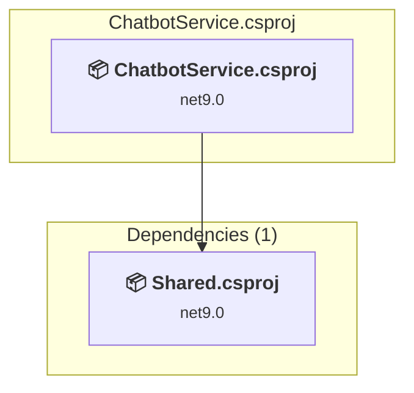

# src\ChatbotService\ChatbotService.csproj

[← Back to the assessment index](../../assessment.md)

## Project Info

- **Current Target Framework:** net9.0
- **Proposed Target Framework:** net10.0
- **SDK-style**: True
- **Project Kind:** AspNetCore
- **Dependencies**: 1
- **Dependants**: 0
- **Number of Files**: 36
- **Number of Files with Incidents**: 5
- **Lines of Code**: 5396
- **Estimated LOC to modify**: 27+ (at least 0,5% of the project)

## Related Projects

**Depends on (1)** — projects this one references:

- [e:\WorkFiles\Repos\DistributedOrderSystem\src\Shared\Shared.csproj](../projects/Shared.md)

## Dependency Graph

Legend:
📦 SDK-style project
⚙️ Classic project

## API Compatibility

| Category | Count | Impact |
| :--- | :---: | :--- |
| 🔴 Binary Incompatible | 12 | High - Require code changes |
| 🟡 Source Incompatible | 5 | Medium - Needs re-compilation and potential conflicting API error fixing |
| 🔵 Behavioral change | 10 | Low - Behavioral changes that may require testing at runtime |
| ✅ Compatible | 5594 |  |
| ***Total APIs Analyzed*** | ***5621*** |  |

## NuGet Package Issues

| Package | Current Version | Suggested Version | Severity | Issue |
| :--- | :---: | :---: | :---: | :--- |
| Microsoft.AspNetCore.Authentication.JwtBearer | 9.0.0 | 10.0.12 | 🟡 Potential | NuGet package upgrade is recommended |
| Microsoft.AspNetCore.OpenApi | 9.0.0 | 10.0.12 | 🟡 Potential | NuGet package upgrade is recommended |
| Microsoft.EntityFrameworkCore | 9.0.0 | 10.0.12 | 🟡 Potential | NuGet package upgrade is recommended |
| Microsoft.EntityFrameworkCore.Tools | 9.0.0 | 10.0.12 | 🟡 Potential | NuGet package upgrade is recommended |
| Microsoft.Extensions.Http | 9.0.0 | 10.0.12 | 🟡 Potential | NuGet package upgrade is recommended |
| Newtonsoft.Json | 13.0.3 | 13.0.4 | 🟡 Potential | NuGet package upgrade is recommended |
| System.Text.Json | 9.0.0 | 10.0.12 | 🟡 Potential | NuGet package upgrade is recommended |

Every project affected by these packages, and the versions the repository settles on: [aggregate NuGet packages](../nuget/aggregate-packages.md).

## Project Technologies and Features

| Technology | Issues | Percentage | Migration Path |
| :--- | :---: | :---: | :--- |
| IdentityModel & Claims-based Security | 7 | 25,9% | Windows Identity Foundation (WIF), SAML, and claims-based authentication APIs that have been replaced by modern identity libraries. WIF was the original identity framework for .NET Framework. Migrate to Microsoft.IdentityModel.* packages (modern identity stack). |

