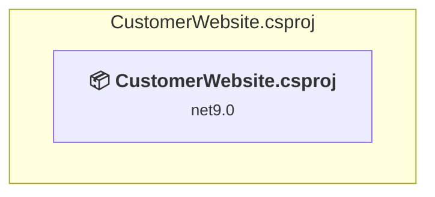

# src\frontend\customer-facing e-commerce\CustomerWebsite\CustomerWebsite.csproj

[← Back to the assessment index](../../assessment.md)

## Project Info

- **Current Target Framework:** net9.0
- **Proposed Target Framework:** net10.0
- **SDK-style**: True
- **Project Kind:** AspNetCore
- **Dependencies**: 0
- **Dependants**: 0
- **Number of Files**: 29
- **Number of Files with Incidents**: 5
- **Lines of Code**: 3832
- **Estimated LOC to modify**: 22+ (at least 0,6% of the project)

## Dependency Graph

Legend:
📦 SDK-style project
⚙️ Classic project

## API Compatibility

| Category | Count | Impact |
| :--- | :---: | :--- |
| 🔴 Binary Incompatible | 8 | High - Require code changes |
| 🟡 Source Incompatible | 0 | Medium - Needs re-compilation and potential conflicting API error fixing |
| 🔵 Behavioral change | 14 | Low - Behavioral changes that may require testing at runtime |
| ✅ Compatible | 3630 |  |
| ***Total APIs Analyzed*** | ***3652*** |  |

## NuGet Package Issues

| Package | Current Version | Suggested Version | Severity | Issue |
| :--- | :---: | :---: | :---: | :--- |
| AutoMapper.Extensions.Microsoft.DependencyInjection | 12.0.1 | — | 🔵 Optional | NuGet package is deprecated |
| FluentValidation.AspNetCore | 11.3.0 | — | 🔵 Optional | NuGet package is deprecated |
| Microsoft.AspNetCore.Authentication.JwtBearer | 9.0.0 | 10.0.12 | 🟡 Potential | NuGet package upgrade is recommended |
| Microsoft.AspNetCore.SignalR.Client | 9.0.0 | 10.0.12 | 🟡 Potential | NuGet package upgrade is recommended |
| Microsoft.EntityFrameworkCore | 9.0.0 | 10.0.12 | 🟡 Potential | NuGet package upgrade is recommended |
| Microsoft.EntityFrameworkCore.SqlServer | 9.0.0 | 10.0.12 | 🟡 Potential | NuGet package upgrade is recommended |
| Microsoft.EntityFrameworkCore.Tools | 9.0.0 | 10.0.12 | 🟡 Potential | NuGet package upgrade is recommended |
| Microsoft.Extensions.Caching.StackExchangeRedis | 9.0.0 | 10.0.12 | 🟡 Potential | NuGet package upgrade is recommended |
| Microsoft.Extensions.Http | 9.0.0 | 10.0.12 | 🟡 Potential | NuGet package upgrade is recommended |
| Newtonsoft.Json | 13.0.3 | 13.0.4 | 🟡 Potential | NuGet package upgrade is recommended |
| RestSharp | 110.2.0 | 114.0.0 | 🔵 Optional | NuGet package contains security vulnerability |

Every project affected by these packages, and the versions the repository settles on: [aggregate NuGet packages](../nuget/aggregate-packages.md).

