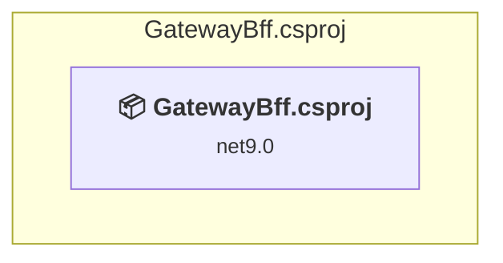

# src\GatewayBff\GatewayBff.csproj

[← Back to the assessment index](../../assessment.md)

## Project Info

- **Current Target Framework:** net9.0
- **Proposed Target Framework:** net10.0
- **SDK-style**: True
- **Project Kind:** AspNetCore
- **Dependencies**: 0
- **Dependants**: 0
- **Number of Files**: 55
- **Number of Files with Incidents**: 6
- **Lines of Code**: 1999
- **Estimated LOC to modify**: 35+ (at least 1,8% of the project)

## Dependency Graph

Legend:
📦 SDK-style project
⚙️ Classic project

## API Compatibility

| Category | Count | Impact |
| :--- | :---: | :--- |
| 🔴 Binary Incompatible | 1 | High - Require code changes |
| 🟡 Source Incompatible | 0 | Medium - Needs re-compilation and potential conflicting API error fixing |
| 🔵 Behavioral change | 34 | Low - Behavioral changes that may require testing at runtime |
| ✅ Compatible | 3704 |  |
| ***Total APIs Analyzed*** | ***3739*** |  |

## NuGet Package Issues

| Package | Current Version | Suggested Version | Severity | Issue |
| :--- | :---: | :---: | :---: | :--- |
| Microsoft.AspNetCore.OpenApi | 9.0.0 | 10.0.12 | 🟡 Potential | NuGet package upgrade is recommended |

Every project affected by these packages, and the versions the repository settles on: [aggregate NuGet packages](../nuget/aggregate-packages.md).

