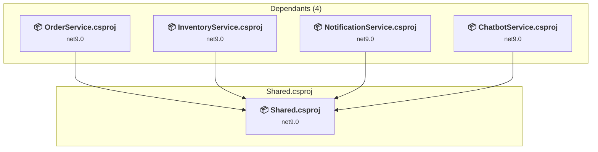

# src\Shared\Shared.csproj

[← Back to the assessment index](../../assessment.md)

## Project Info

- **Current Target Framework:** net9.0
- **Proposed Target Framework:** net10.0
- **SDK-style**: True
- **Project Kind:** ClassLibrary
- **Dependencies**: 0
- **Dependants**: 4
- **Number of Files**: 2
- **Number of Files with Incidents**: 1
- **Lines of Code**: 88
- **Estimated LOC to modify**: 0+ (at least 0,0% of the project)

## Related Projects

**Depended on by (4)** — projects that reference this one:

- [e:\WorkFiles\Repos\DistributedOrderSystem\src\ChatbotService\ChatbotService.csproj](../projects/ChatbotService.md)
- [e:\WorkFiles\Repos\DistributedOrderSystem\src\InventoryService\InventoryService.csproj](../projects/InventoryService.md)
- [e:\WorkFiles\Repos\DistributedOrderSystem\src\NotificationService\NotificationService.csproj](../projects/NotificationService.md)
- [e:\WorkFiles\Repos\DistributedOrderSystem\src\OrderService\OrderService.csproj](../projects/OrderService.md)

## Dependency Graph

Legend:
📦 SDK-style project
⚙️ Classic project

## API Compatibility

| Category | Count | Impact |
| :--- | :---: | :--- |
| 🔴 Binary Incompatible | 0 | High - Require code changes |
| 🟡 Source Incompatible | 0 | Medium - Needs re-compilation and potential conflicting API error fixing |
| 🔵 Behavioral change | 0 | Low - Behavioral changes that may require testing at runtime |
| ✅ Compatible | 63 |  |
| ***Total APIs Analyzed*** | ***63*** |  |

